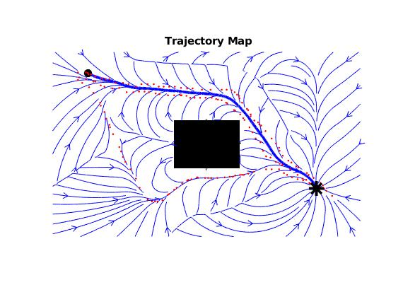

# :robot: **Fast Marching Learning Method** :robot:

This repository summarizes the use of the Fast Marching Learning method described in the paper ["Kinesthetic Learning Based on Fast Marching Square Method for Manipulation"](https://www.mdpi.com/2076-3417/13/4/2028) for Learning from Demonstration (LfD).
<p align="center">
  
</p>

This project presents a simple case of use of the 2D Fast Marching Learning method. The code is written in Matlab and it is based on the [Fast Marching Toolbox](https://www.mathworks.com/matlabcentral/fileexchange/6110-toolbox-fast-marching) but with some modifications. The code is divided in two main parts: the first one is the generation of the training data and the second one is the learning of the Fast Marching Square method.

# Installation :computer:
* Matlab 2018b or higher
* [Fast Marching Toolbox](https://www.mathworks.com/matlabcentral/fileexchange/6110-toolbox-fast-marching) (optional)
* [Matlab Robotics Toolbox](https://www.mathworks.com/matlabcentral/fileexchange/69460-robotics-toolbox-for-matlab) (optional, oly for applications with a robotic model)

# Usage :book:
The code is divided in diferent folders:
* `algorithms`: contains the main algorithms used. It is conformed by the ```FM2_VelcoityMap.m``` that generates the velocity map (cost maps) for the Fast Marching Square method, ```FM2D.m``` that implements the Fast Marching Square method and ```FM2D_Learning.m``` that implements the Fast Marching Learning method.
* `examples`: contains the examples of use of the Fast Marching Learning method. It is conformed by the ```fm2example.m``` that shows a simple example of use of the Fast Marching Square method in 2D and ```fmlexample.m``` that shows a simple example of use of the Fast Marching Learning method in 2D.
* `fm2tools`: contains the functions used in the examples. It is conformed by the ```checkLimits.m``` that control that the points work in the limits of the map, ```def_fuzzy_object.m``` that fuzzy the data to be used by the Fast Marching Learning method, ```euc_dist.m``` that estimate the Euclidean distance between 2 points and ```kinesthetic_teaching.m``` that allow the user to take data clicking in the map with the mouse.

To use the Fast Marching Learning method, the user must run the ```fmlexample.m``` script. This script will show a map where the user can click with the mouse to take data. The user must click in the map to take data. The first click will be the initial point and the second click will be the goal point. The user can take as many data as he wants. When the user finish to take data, he must press right button to finish the data taking.  The script will show the learning process and the final result. 

The user can change the parameters of the learning process in the script. Those parameters are:
* `n`: number of points to take data
* `mapname`: map as an image
* `sat`: represents the saturation of the values of the cost map, between (0,1). A very low saturation will produce that the method follows strictly the demonstration data. A very high saturation will produce that the method will not follow strictly the demonstration data and can optimized the path.
* `aoi_size`: represent the area of interest of the path (represented in pixels in 2D). If this value is low, the model generated is very thin. If this value is high, the model generated is very thick and can be very far from the demonstration data.

# Citation :pencil:

If you use this code for your research ot think that it is interesting , please cite the following paper:

```
@article{prados2023kinesthetic,
  title={Kinesthetic Learning Based on Fast Marching Square Method for Manipulation},
  author={Prados, Adri{\'a}n and Mora, Alicia and L{\'o}pez, Blanca and Mu{\~n}oz, Javier and Garrido, Santiago and Barber, Ram{\'o}n},
  journal={Applied Sciences},
  volume={13},
  number={4},
  pages={2028},
  year={2023},
  publisher={MDPI}
}
```